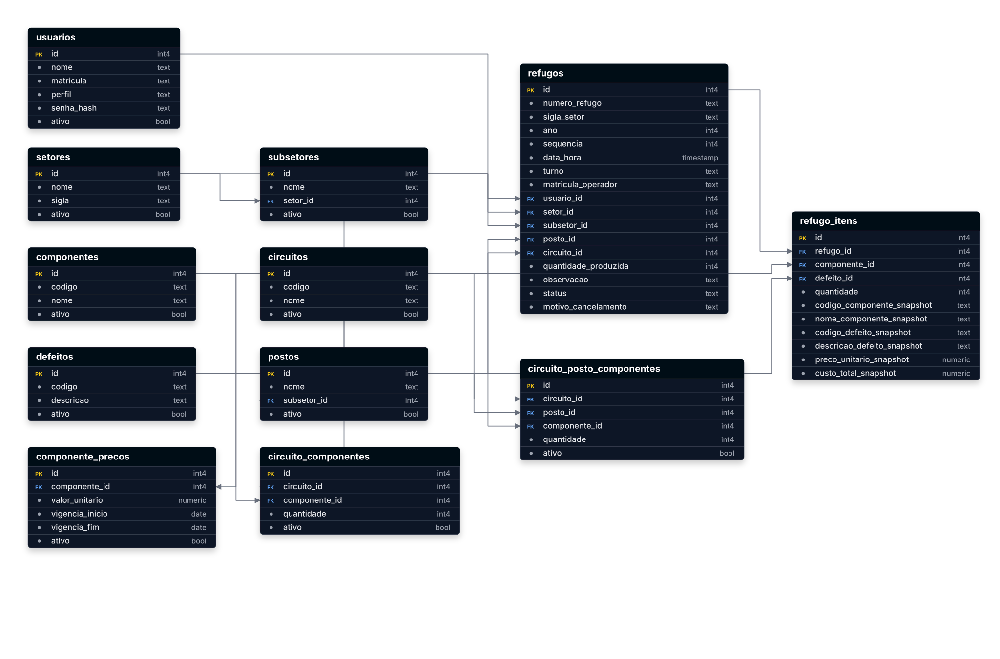

# FactoryFlow

<h2 align="center">Diagrama do Banco de Dados</h2>
<p align="center">
  
</p>


```
FactoryFlow/
├── database/                  # Banco de dados utilizado pela aplicação
├── dist/                      # Build gerada pelo Electron Vite
├── node_modules/
├── out/                       # Arquivos compilados
├── resources/                 # Recursos da aplicação (ícones, etc.)
│
├── src/
│   ├── main/                  # Processo principal do Electron
│   │   ├── database/          # Conexão e inicialização do banco
│   │   ├── ipc/               # Comunicação IPC
│   │   ├── print/             # Serviços de impressão
│   │   ├── repositories/      # Acesso aos dados (SQLite)
│   │   ├── services/          # Regras de negócio
│   │   └── index.ts           # Inicialização do Electron
│   │
│   ├── preload/              # API exposta ao Renderer
│   │
│   └── renderer/
│       └── src/
│           ├── assets/        # Imagens, ícones e arquivos estáticos
│           ├── components/    # Componentes reutilizáveis
│           ├── config/        # Configurações da aplicação
│           ├── contexts/      # React Context API
│           ├── models/        # Interfaces e modelos TypeScript
│           ├── pages/         # Telas do sistema
│           ├── routes/        # Rotas do React Router
│           ├── services/      # Comunicação com o Backend (IPC)
│           ├── styles/        # Estilos CSS
│           ├── theme/         # Tema global da aplicação
│           ├── App.tsx
│           ├── global.d.ts
│           ├── index.css
│           ├── main.tsx
│           └── vite-env.d.ts
│
├── .gitignore
├── electron-builder.yml
├── electron.vite.config.ts
├── package.json
├── package-lock.json
└── README.md
```


| Pasta          | Responsabilidade                                                 |
| -------------- | ---------------------------------------------------------------- |
| `main`         | Processo principal do Electron (Banco, IPC, Impressão, Serviços) |
| `preload`      | Ponte segura entre Electron e React                              |
| `renderer`     | Interface do usuário (React + TypeScript)                        |
| `repositories` | Comunicação direta com o SQLite                                  |
| `services`     | Regras de negócio da aplicação                                   |
| `ipc`          | Comunicação entre Front-end e Back-end                           |
| `print`        | Geração e impressão das fichas de refugo                         |
| `pages`        | Telas da aplicação                                               |
| `components`   | Componentes reutilizáveis                                        |
| `theme`        | Padronização visual da Nossa Aplicação                               |


---
---
```
┌───────────────────────────────┐
│ FRONT-END                     │
│                               │
│ React                         │
│ Pages                         │
│ Components                    │
└───────────────┬───────────────┘
                │
                ▼
┌───────────────────────────────┐
│ PRELOAD                       │
│ (Ponte segura)                │
│                               │
│ window.api.refugos.criar()    │
│ window.api.setores.listar()   │
└───────────────┬───────────────┘
                │
                │ IPC
                ▼
┌───────────────────────────────┐
│ BACK-END                      │
│                               │
│ ipcMain                       │
│ Services                      │
│ Repositories                  │
│ SQLite                        │
└───────────────────────────────┘
```

---
---

```
           FRONT-END

┌──────────────────────────┐
│ React                    │
│ Pages                    │
│ Components               │
└─────────────┬────────────┘
              │
              ▼
┌──────────────────────────┐
│ Preload                  │
│ (Porteiro)               │
└─────────────┬────────────┘
              │ IPC
══════════════╬══════════════
              ▼
┌──────────────────────────┐
│ Main Process             │
│ (Back-end)               │
└─────────────┬────────────┘
              ▼
┌──────────────────────────┐
│ Services                 │
└─────────────┬────────────┘
              ▼
┌──────────────────────────┐
│ Repositories             │
│ (SQL)                    │
└─────────────┬────────────┘
              ▼
┌──────────────────────────┐
│ SQLite                   │
└──────────────────────────┘
```

---
---

```
                           FACTORYFLOW - ARQUITETURA

                           ┌──────────────────────────────┐
                           │        FRONT-END             │
                           │        (Renderer)            │
                           └──────────────────────────────┘

┌───────────────────────────────────────────────────────────────────────────────────────────┐
│ React                                                                                     │
│-------------------------------------------------------------------------------------------│
│ • Pages (Telas do sistema)                                                                │
│ • Components (Componentes reutilizáveis)                                                  │
│ • Contexts (Estado global da aplicação)                                                   │
│ • Routes (Navegação entre telas)                                                          │
│ • Services (Chamadas para window.api)                                                     │
└──────────────────────────────────────┬────────────────────────────────────────────────────┘
                                       │
                                       │ O React NÃO acessa o banco de dados.
                                       │ Apenas solicita operações.
                                       ▼
┌───────────────────────────────────────────────────────────────────────────────────────────┐
│ PRELOAD                                                                                   │
│-------------------------------------------------------------------------------------------│
│ Responsabilidade:                                                                         │
│                                                                                           │
│ • Expõe funções seguras ao React                                                          │
│ • Não contém regra de negócio                                                             │
│ • Não executa SQL                                                                         │
│                                                                                           │
│ Exemplo:                                                                                  │
│ window.api.refugos.criar()                                                                │
│ window.api.setores.listar()                                                               │
│ window.api.importacao.importar()                                                          │
└──────────────────────────────────────┬────────────────────────────────────────────────────┘
                                       │
                                       │ ipcRenderer.invoke(...)
                                       │
═══════════════════════════════════════ IPC ═══════════════════════════════════════════════════
             Comunicação entre Renderer e Main Process
═══════════════════════════════════════════════════════════════════════════════════════════════
                                       │
                                       ▼
┌───────────────────────────────────────────────────────────────────────────────────────────┐
│ MAIN PROCESS (Electron / Node.js)                                                         │
│-------------------------------------------------------------------------------------------│
│ Responsável por acessar recursos do sistema operacional.                                  │
│                                                                                           │
│ Pode acessar:                                                                             │
│ • SQLite                                                                                  │
│ • Impressoras                                                                             │
│ • Arquivos                                                                                │
│ • Pastas                                                                                  │
└──────────────────────────────────────┬────────────────────────────────────────────────────┘
                                       │
                                       ▼
┌───────────────────────────────────────────────────────────────────────────────────────────┐
│ IPC HANDLERS                                                                              │
│-------------------------------------------------------------------------------------------│
│ Arquivos da pasta ipc/                                                                    │
│                                                                                           │
│ Exemplo:                                                                                  │
│ refugo.ipc.ts                                                                             │
│ setor.ipc.ts                                                                              │
│ usuario.ipc.ts                                                                            │
│ importacao.ipc.ts                                                                         │
│                                                                                           │
│ Apenas recebem a solicitação do React e encaminham para os Services.                      │
└──────────────────────────────────────┬────────────────────────────────────────────────────┘
                                       │
                                       ▼
┌───────────────────────────────────────────────────────────────────────────────────────────┐
│ SERVICES                                                                                  │
│-------------------------------------------------------------------------------------------│
│ Contêm as regras de negócio da aplicação.                                                 │
│                                                                                           │
│ Exemplo:                                                                                  │
│ • Validar dados                                                                           │
│ • Cancelar um lançamento                                                                  │
│ • Imprimir ficha                                                                          │
│ • Gerar relatórios                                                                        │
│ • Decidir quais operações executar                                                        │
│                                                                                           │
│ Os Services NÃO conhecem a interface gráfica.                                             │
└──────────────────────────────────────┬────────────────────────────────────────────────────┘
                                       │
                                       ▼
┌───────────────────────────────────────────────────────────────────────────────────────────┐
│ REPOSITORIES                                                                              │
│-------------------------------------------------------------------------------------------│
│ Responsáveis exclusivamente pelo acesso ao banco.                                         │
│                                                                                           │
│ Aqui ficam praticamente TODOS os comandos SQL:                                            │
│                                                                                           │
│ SELECT                                                                                    │
│ INSERT                                                                                    │
│ UPDATE                                                                                    │
│ DELETE                                                                                    │
│                                                                                           │
│ Exemplo:                                                                                  │
│ RefugoRepository.ts                                                                       │
│ UsuarioRepository.ts                                                                      │
│ SetorRepository.ts                                                                        │
└──────────────────────────────────────┬────────────────────────────────────────────────────┘
                                       │
                                       ▼
┌───────────────────────────────────────────────────────────────────────────────────────────┐
│ DATABASE                                                                                  │
│-------------------------------------------------------------------------------------------│
│ SQLite                                                                                    │
│                                                                                           │
│ Arquivo:                                                                                  │
│ database/factoryflow.db                                                                   │
│                                                                                           │
│ Guarda todos os dados do FactoryFlow.                                                     │
└───────────────────────────────────────────────────────────────────────────────────────────┘
```