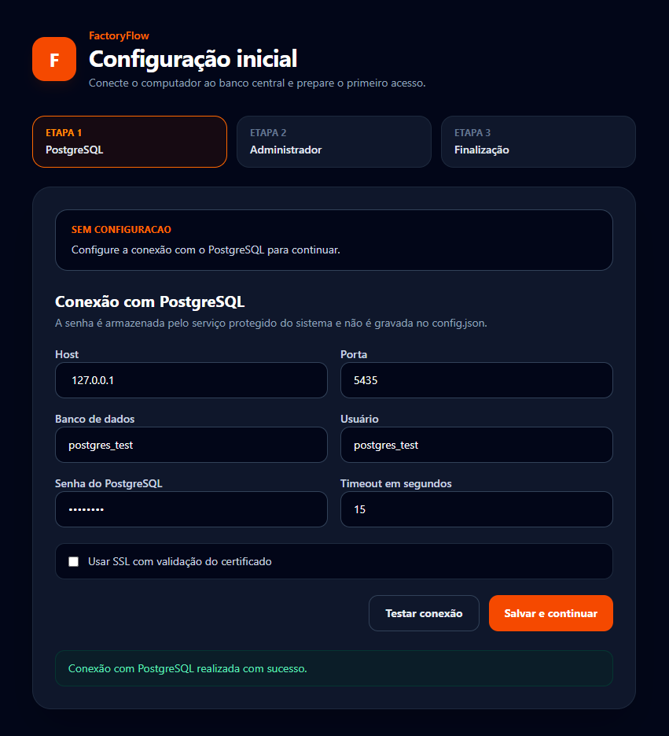
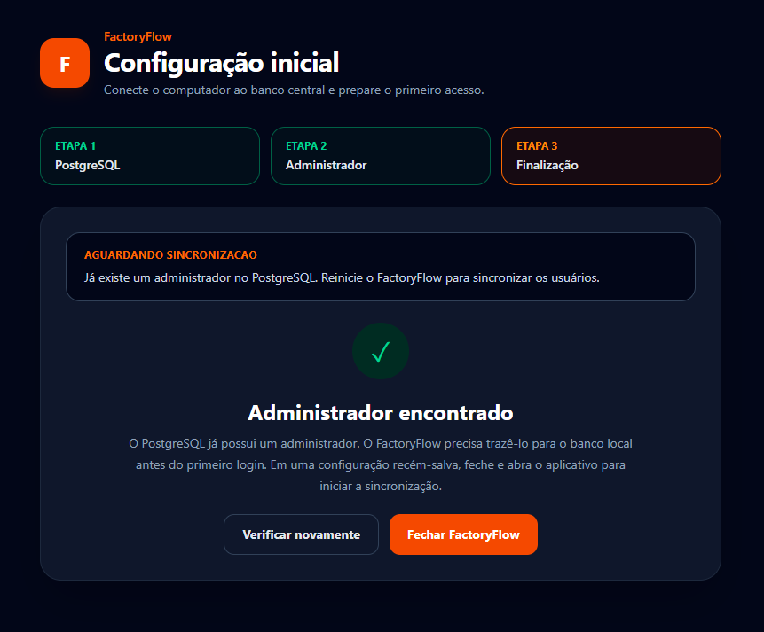

# Testes do FactoryFlow

Este documento registra os testes manuais e integrados executados durante o desenvolvimento do FactoryFlow.

## Menu

1. [Configuração inicial — administrador remoto existente](#1-configuração-inicial--administrador-remoto-existente)
2. [Configuração inicial — criação do primeiro administrador](#2-configuração-inicial--criação-do-primeiro-administrador)

---

## 1. Configuração inicial — administrador remoto existente

### Objetivo

Validar o primeiro acesso de um computador novo conectado a um PostgreSQL que já possui um administrador ativo.

### 1.1 Configuração do PostgreSQL

A conexão com o banco central foi configurada usando o ambiente PostgreSQL de testes.

<p align="center">
  
</p>

Resultado:

- conexão estabelecida com sucesso;
- configuração salva localmente;
- senha armazenada pelo serviço protegido do Electron;
- aplicação preparada para consultar o banco central.

### 1.2 Administrador remoto encontrado

Após salvar a configuração, o FactoryFlow encontrou um administrador existente no PostgreSQL.

<p align="center">
  
</p>

Resultado:

- administrador remoto identificado;
- aplicação solicitou reinicialização;
- usuários sincronizados para o SQLite local;
- tela de login liberada após a sincronização.

### 1.3 Validação da sessão

Resultado retornado por:

```js
await window.api.auth.sessaoAtual()